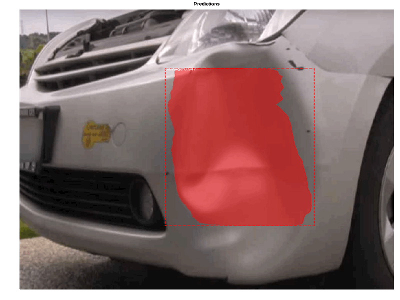

# Using Mask R-CNN to detect Car Damage
Using the amazing Matterport's [Mask_RCNN](https://github.com/nicolasmetallo/Mask_RCNN) implementation and following Priya's [example](https://www.analyticsvidhya.com/blog/2018/07/building-mask-r-cnn-model-detecting-damage-cars-python/), I trained an algorithm that highlights areas where there is damage to a car (i.e. dents, scratches, etc.). 
The script uses tensorflow-gpu, therefore I recommend creating the following environment using anaconda:
- Create a conda environment called tf_gpu:
``` 
conda create --name tf_gpu python=3.7
```
- Activate the newly-created environment:
```
conda activate tf_gpu
```
- Set up the CUDA prerequisite (this requires having a CUDA-capable graphics card). Since the version of tensorflow is 1.13.1, you need CUDA v10 and CUDNN 7.4.0. If you want to use other versions of tensorflow, follow this page for the right CUDA versions: https://www.tensorflow.org/install/source_windows#gpu
```
conda install -c conda-forge cudatoolkit=10 cudnn=7.4.0
```
- Install all prerequisites by running the following command in the root directory of the project:
```
pip install -r requirements.txt
```

```
Run from the command line as such:

    # Train a new model starting from pre-trained COCO weights
    python3 custom.py train --dataset=/path/to/dataset --weights=coco

    # Resume training a model that you had trained earlier
    python3 custom.py train --dataset=/path/to/dataset --weights=last

    # Train a new model starting from ImageNet weights
    python3 custom.py train --dataset=/path/to/dataset --weights=imagenet

    # Apply color splash to an image
    python3 custom.py splash --weights=/path/to/weights/file.h5 --image=<URL or path to file>

    # Apply color splash to video using the last weights you trained
    python3 custom.py splash --weights=last --video=<URL or path to file>
"""
```



## Gather training data
Use the [google-images-download](https://github.com/hardikvasa/google-images-download) library or look manually for images in Google Images or Flickr. I chose Flickr and filter by the photos allowed for 'commercial and other mod uses'. I downloaded 80 images into the 'images' folder.

## Installation
This script supports Python 2.7 and 3.7, although if you run into problems with TensorFlow and Python 3.7, it might be easier to just run everything from Google Colaboratory notebook.

## Clone this repository
````
$ git clone https://github.com/nicolasmetallo/car-damage-detector.git
````

## Install pre-requisites
```
$ pip install -r requirements.txt
```

## Split dataset into train, val, test
Run the 'build_dataset.py' script to split the 'images' folder into train, val, test folders.
```
$ python3 build_dataset.py --data_dir='images' --output_dir='dataset'
```

## Train your model
We download the 'coco' weights and start training from that point with our custom images (transfer learning). It will download the weights automatically if it can't find them. Training takes around 4 mins per epoch with 10 epochs.
```
$ python3 custom.py --dataset='dataset' --weights=coco # it will download coco weights if you don't have them
```
